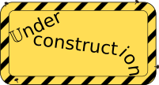

# <p align="center">CanDev</p>
<p align="center"></p>

CAN is a well known industrial bus which has a lot of applications. This bus is supported by STM32F103x. Unfortunately you can't connect MCU directly to CAN bus, because transceiver is required. Luckily, there are a lot of CAN transceivers available on the market in different packages (including DIP-8) which may be used by amateurs. Refer to specific IC data sheet for scheme and etc. Note, STM32f103 may use pin remapping for CAN. Both sets of pins (`PA_11`/`PA_12` and `PB_8`/`PB_9`) are 5V tolerant, so possibly, you may use transceivers with 5V logical levels. I didn't test it: in my case I used transceiver with 5V logical level interface and simple level shifter.

**Currently this functionality is under development/verification. That's why it may work unstable; Implementation may change in future and documentation may be incomplete, inexact or absent.**

Use the
```
"CanCustomizer": {
      "can_0" : {
        "dev_id" : 1,
        "buffered_msg_count" : 256,
        "bitrate": 1000,
        "requires" :  {"can" : "CAN1_REMAP"}
      }
    }
```

| Key      | Value description | Possible values | Required |
|:---------|:------------------|:----------------|:---------|
| `"can_0"` | Name of the CanDev virtual device. | String | Yes |
| `"dev_id"` | Device id. | Number, [1, 15] | Yes |
| `"buffered_msg_count"` | Size of the receive circular buffer in messages. | Number | Yes |
| `"bitrate"` | Bitrate for the CAN bus (in kbit/s). | `10`,`20`,`50`,`83`,`100`,`125`,`250`,`500`,`800`,`1000`  | Yes |
| `"requires"` | Describes peripherals required by the virtual device. Just `can` should be specified. | `CAN1` or `CAN1_REMAP` | Yes |

Note: STM32F103x has CAN and USB sharing a dedicated SRAM memory for data transmission and reception, so it is not possible to use CAN and USB at the same time.

<p align="center"></p>