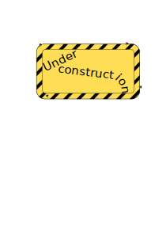

# <p align="center">INFODev</p>
<p align="center"></p>

<p align="center"></p>

## Description
...

## JSON configuration file

```
... JSON EXAMPLE ...
```

... Keys description table ...
| Key      | Value description | Possible values | Required |
|:---------|:------------------|:----------------|:---------|
| `"dev_id"` | Device id | Number, [1, 15] | Yes |

## libHLEK device interface
... Interfaces and their description in libhlek ...

## Notes
... Notes, if there are something to note ...
