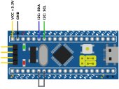

# 
I2C Communication Test

Purpose:
Test I2C bus, circular buffer with long loaded from multithreaded application.
Testing is done by using four devices:

* INFODev - access from linear buffer
* ADCDev (dma mode) - to generate some data into circular buffer and read it
* TimeTrackerDev - to generate some data into circular buffer and read it
* SPWM - to provide interrupt source for TimeTrackerDev.

